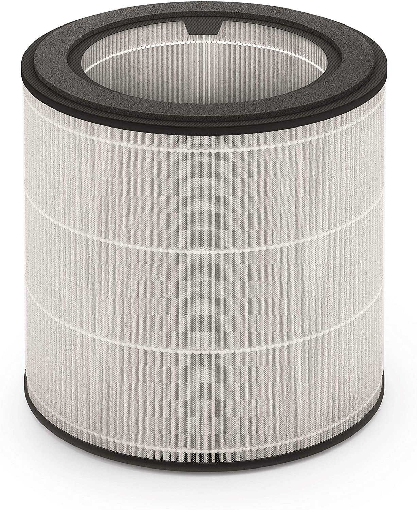
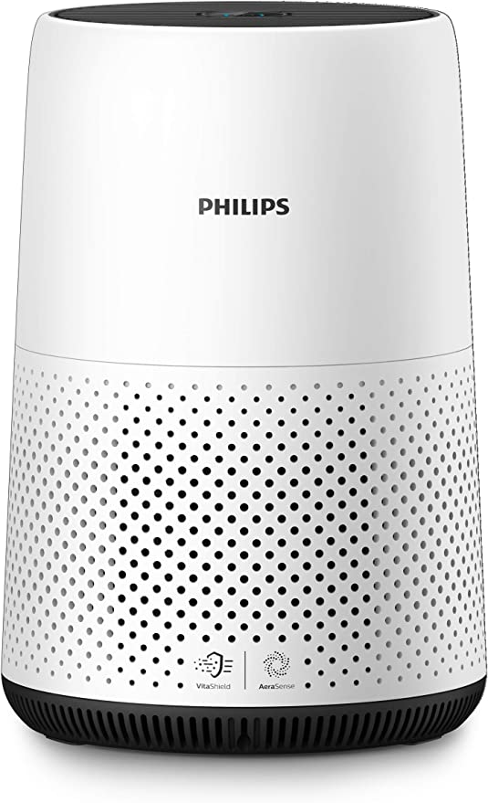
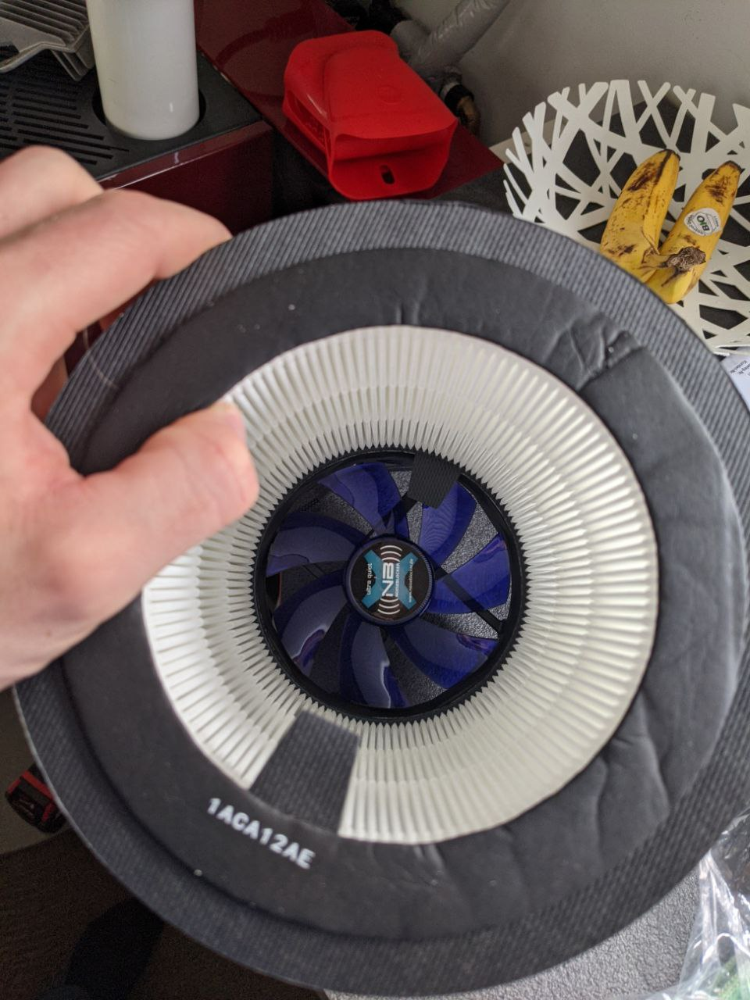

# Low Noise Air Purifier

## Air Filter and intended usage

I desided to go for belows air filter as they are available quite cheap and have good reviews also from TÜV.
[Air filter from Philips 800 Series](https://www.amazon.de/Philips-NanoProtect-replacement-FY0194-30/dp/B07W7YYNFX). HEPA-2 bis $0.003~\mu m$. Modell-bez.: *Philips 800 Series NanoProtect HEPA Ersatz Luftreiniger Filter FY0194/30*

It has an inner diameter around $140~mm$ and and outer diameter of around $250$ diameter.

 

Just for comparison they are compatible with [Philip's air purifier](https://www.amazon.de/Philips-AC0820-10-Luftreiniger-Allergiker/dp/B07WBYD5NT) having the following specs:
- rated for an room size up to $49~m^2$
- airflow-rate of $190~m^3/h$
- noise emission of $35~dB$

 

## Air Vents

I put together some fans which have quite promising specs. Note that aboves spec for Philip's air purifier are rated with the filter **installed**.
So while below air flow rate of the fans will easily beat the one specified by Philips, they will drop after the filter being installed. As there is not much spec regarding the filter itself, they would need to be measured afterwards for proper comparability.

| Modelname | Airflow rate $[m^3/h]$ | Noise emission $[dB(A)]$ | Costs p.u. |
|---|---|---|---|
| [NB XK-2](https://www.blacknoise.com/site/de/produkte/noiseblocker-it-luefter/nb-blacksilentfan-series/140x140x25mm.php)| 85.0 | 20 | 9 |
| [NB B14-3](https://www.blacknoise.com/site/de/produkte/noiseblocker-it-luefter/nb-eloop-series/140x140x29mm.php)| 178.3 | 28.7 | 25 |
| [SST AP140](https://www.silverstonetek.com/product.php?pid=947&bno=54&tb=101&area=en)| 109.3 | 30.1 | 18 |
| [SST FHP141](https://www.silverstonetek.com/product.php?pid=366&bno=54&tb=101&area=en)| 290.5 | 43 | 19 |

## Assembly

.. was easier than I thought. The filter comes with some foam-ring which initially had the wrong diameter to correctly seal the fan, but was easily removable. Some wooden-screws and due to the stiff filter frame the fans were mounted good enough for a test run.

The fans were installed on both ends in an "Pull-Pull" configuration, as this is the intended airflow direction for this filter.

 

I used the **NB XK-2** which turned out producing far too less airflow. My assumption is that not only the airflow rate, but also the capability of the fan for creating an negative pressure is important for this usecase.

However, it's impossible to hear any noise coming out from the fans, which is not surprising as low noise is one of the major selling points of this brand.

